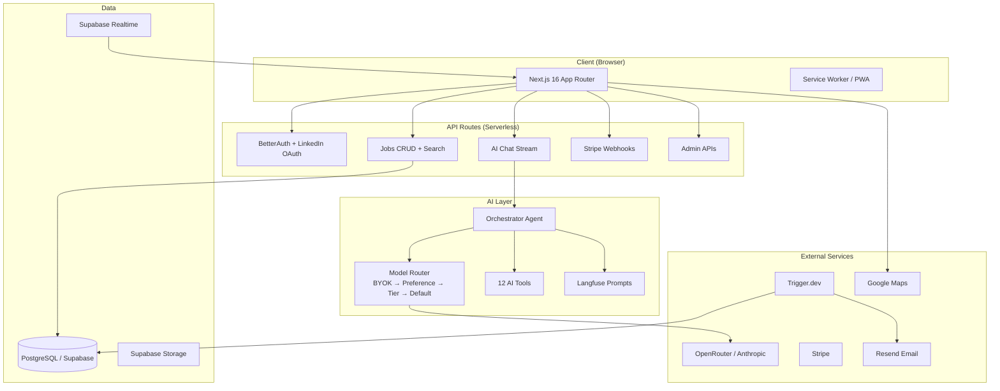

<div align="center">

<a href="https://hust.so">
  
</a>

# Ever® Hust™ — The Anti-Hustle Career OS

**An open agentic job-search platform that finds, evaluates and tailors your applications, then tracks every one from first search to signed offer.**

[](https://www.gnu.org/licenses/agpl-3.0)
[](https://github.com/ever-hust/ever-hust/actions/workflows/ci.yml)
[](CONTRIBUTING.md)
[](https://www.typescriptlang.org)
[](https://hust.so)
[](https://docs.hust.so)
[](https://discord.gg/hust)
[](https://x.com/hust_so)

[Website](https://hust.so) · [Documentation](https://docs.hust.so) · [Live App](https://hust.so) · [Discord](https://discord.gg/hust) · [Roadmap](docs/PRD.md)

</div>

---

> [!NOTE]
> **Hust is a standalone product.** It runs fully without any Gauzy product — its only hard
> external dependency is the **Ever Jobs API** (job listings). It *optionally* integrates with the
> wider **Ever Gauzy** platform for the agency/company scenario. See
> [Relationship to Ever Gauzy / Ever Jobs](docs/GAUZY-INTEGRATION.md).

## 🌟 What is it

Hust is an open-source, AI-native platform that takes a job seeker through the entire journey — from the first search to a signed offer — without the spray-and-pray grind. The interface is conversational: an AI assistant on the left, a live jobs canvas on the right. But unlike a job board or a search box, Hust doesn't just *find* roles — it **evaluates** them for you, **tailors** your applications, and **tracks** every one through to the offer.

*Anti-Hustle* is the whole point: instead of pushing you to apply to more, Hust helps you apply to **fewer, better** jobs. It scores each opening against your CV and goals with an explainable fit verdict — and an honest "don't bother" when the math says so — flags postings that may not be real with a **ghost-job radar**, turns your profile into real, ATS-ready résumés and cover letters (generated with your sign-off, never sent behind your back), preps you with a **STAR interview story bank**, scripts your **salary negotiation**, and runs **funnel analytics** that learn from your outcomes to sharpen your targeting.

Two principles run through everything: **quality over quantity** and **human-in-the-loop**. Hust is built to say *no* on your behalf — to bad-fit roles and fake postings — and never applies for you without explicit consent. Your data stays yours, the source is auditable, and the AI's job is to advise, not to grind.

Hust works for individuals out of the box and scales to **agencies and enterprises** — organizations, teams, an admin console, an enterprise API, and white-label branding are built in, and an **optional integration with the Ever Gauzy platform** adds employee/org sync (SSO) and automated apply-at-scale. Hust's only hard dependency is the **Ever Jobs** sourcing API; everything else — including the Gauzy integration — is optional. Released under **AGPL-3.0**.

## ✨ Features

The candidate journey, end to end: **find → evaluate → tailor → apply → interview → negotiate → track**.

| Category                | Feature                       | Details                                                                                         |
| ----------------------- | ----------------------------- | ----------------------------------------------------------------------------------------------- |
| **AI Chat**             | Conversational job search     | Split-screen with persistent sessions, deep-link support                                        |
| **Job Canvas**          | List / Split / Map views      | Realtime updates via Supabase, Google Maps integration                                          |
| **AI Tools**            | 12 orchestrated tools         | Search, apply, cover letters, interview prep, salary insights, company research, resume builder |
| **Favorites & Compare** | Side-by-side comparison       | Compare jobs with "Discuss with AI" integration                                                 |
| **Subscriptions**       | Free / Pro / Enterprise tiers | Stripe checkout, gated features, BYOK API keys                                                  |
| **Alerts**              | Custom job alerts             | Email notifications via Resend (daily/weekly)                                                   |
| **Admin**               | Dashboard + white-label       | User management, analytics, branding, org AI config                                             |
| **Enterprise**          | Teams & API                   | Organization accounts, developer API keys, usage analytics                                      |
| **PWA**                 | Installable + offline         | Service worker, push notifications, offline fallback                                            |
| **i18n**                | Multi-language                | Language switcher in sidebar                                                                    |

> Deeper candidate-workflow depth — the fit-scoring engine, ghost-job radar, document rendering, pipeline, and funnel analytics — is on the active roadmap toward the full Anti-Hustle Career OS. See the [PRD](docs/PRD.md).

## 🖼️ Screenshots

<details>
<summary>Show / hide screenshots</summary>
<br/>

| Conversational job search | Live jobs canvas |
| --- | --- |
|  |  |

> Full walkthroughs and a live demo at **[hust.so](https://hust.so)** and **[docs.hust.so](https://docs.hust.so)**.

</details>

## 🔗 Links

- 🌐 **Website** — https://hust.so
- 📘 **Documentation** — https://docs.hust.so
- 🚀 **Live App** — https://hust.so
- 🧩 **Ever Jobs** (sourcing backend) — https://github.com/ever-jobs/ever-jobs
- 🏢 **Ever Platform** — https://ever.co

## 💻 Demo, Cloud & Self-Hosting

- **Cloud (easiest):** sign up at **[hust.so](https://hust.so)**. Free tier to get started; **Pro** and **Enterprise** tiers unlock unlimited search, advanced agents, and team features.
- **Self-hosting:** Hust is AGPL-3.0 — clone this repo and follow the **Quick Start** below. You can run the whole platform yourself; only the **Ever Jobs API** (for listings) is required. See the AGPL §13 source-availability obligations in the **License** section below.
- **Bring your own keys (BYOK):** use your own Anthropic / OpenRouter key, encrypted at rest.

## 🧱 Technology Stack and Requirements

| Layer               | Technology                                                   |
| ------------------- | ------------------------------------------------------------ |
| **Framework**       | Next.js 16.1 (App Router, Turbopack, Server Components)      |
| **Styling**         | Tailwind CSS 4.1 + ShadCN UI                                 |
| **Build**           | Turborepo monorepo + pnpm                                    |
| **Auth**            | BetterAuth v1 (LinkedIn OAuth)                               |
| **Database**        | PostgreSQL via Supabase (Drizzle ORM)                        |
| **AI**              | Vercel AI SDK v6, OpenRouter, Claude Sonnet 4 default        |
| **Observability**   | Langfuse (prompts + tracing), Sentry, PostHog, OpenTelemetry |
| **Payments**        | Stripe subscriptions + webhooks                              |
| **Email**           | React Email + Resend                                         |
| **Background Jobs** | Trigger.dev v3                                               |
| **State**           | Zustand (client), React Query (server state)                 |
| **Testing**         | Jest (1240 unit tests) + Playwright (E2E)                    |
| **Deployment**      | Vercel                                                       |

**Requirements:** Node.js 22+ · pnpm 10+ · a Supabase project · a LinkedIn Developer App · a Stripe account · an AI provider key (OpenRouter or Anthropic).

## 🏗️ Architecture



### Project Structure

```
ever-hust/
├── apps/web/                # Next.js application
│   ├── app/
│   │   ├── (admin)/         # Admin dashboard (route group)
│   │   ├── (auth)/          # Login / signup (route group)
│   │   ├── (dashboard)/     # Main app: chat, jobs, profile, settings
│   │   ├── (marketing)/     # Landing, pricing, about, contact, docs
│   │   └── api/             # 40+ API routes
│   ├── components/          # React components (canvas, chat, admin, etc.)
│   ├── hooks/               # 18 custom hooks
│   └── lib/                 # Utilities, env, stores, constants
├── packages/
│   ├── ai/                  # Orchestrator, model router, tools, prompts
│   ├── auth/                # BetterAuth config
│   ├── cv-parser/           # CV/resume parsing
│   ├── db/                  # Drizzle ORM schemas + migrations
│   ├── email/               # React Email templates + send helpers
│   ├── jobs-api/            # Ever Jobs external API client
│   ├── stripe/              # Stripe checkout, portal, webhooks
│   ├── supabase/            # Supabase client (Realtime + Storage)
│   ├── triggers/            # Trigger.dev background tasks
│   ├── ui/                  # ShadCN shared components
│   ├── utils/               # Shared utilities
│   └── config/              # Shared configs
├── tests/e2e/               # Playwright E2E tests
└── docs/                    # Documentation
```

## 🚀 Quick Start

### Setup

```bash
# Install dependencies
pnpm install --ignore-scripts

# Copy environment variables
cp .env.example .env.local
# Fill in the values in .env.local

# Push database schema
pnpm db:push

# Seed development data
pnpm db:seed

# Start development
pnpm dev
```

### Commands

```bash
pnpm dev           # Start all apps in development mode
pnpm build         # Build all packages and apps
pnpm lint          # Lint all packages
pnpm check-types   # TypeScript type checking
pnpm test          # Run unit tests (38 suites, 1240 tests)
pnpm test:e2e      # Run Playwright E2E tests
pnpm db:push       # Push schema changes to database
pnpm db:migrate    # Run database migrations
pnpm db:seed       # Seed database with test data
pnpm db:studio     # Open Drizzle Studio
pnpm db:generate   # Generate migration files
```

### Environment Variables

See `.env.example` for the complete list. Key groups:

| Group             | Variables                                                    | Required          |
| ----------------- | ------------------------------------------------------------ | ----------------- |
| **Database**      | `DATABASE_URL`                                               | ✅                |
| **Supabase**      | `NEXT_PUBLIC_SUPABASE_URL`, `NEXT_PUBLIC_SUPABASE_ANON_KEY`  | ✅                |
| **Auth**          | `BETTER_AUTH_SECRET`, `BETTER_AUTH_URL`, `LINKEDIN_CLIENT_*` | ✅                |
| **AI**            | `OPENROUTER_API_KEY` or `ANTHROPIC_API_KEY`                  | ✅ (at least one) |
| **Stripe**        | `STRIPE_SECRET_KEY`, `STRIPE_WEBHOOK_SECRET`                 | Production only   |
| **Email**         | `RESEND_API_KEY`                                             | Production only   |
| **Analytics**     | `NEXT_PUBLIC_POSTHOG_KEY`, `NEXT_PUBLIC_SENTRY_DSN`          | Optional          |
| **Observability** | `LANGFUSE_*`                                                 | Optional          |
| **Maps**          | `NEXT_PUBLIC_GOOGLE_MAPS_API_KEY`                            | Optional          |

## 🧪 Testing

```bash
# Run all unit tests
pnpm test

# Run specific project
pnpm test -- --selectProjects ai
pnpm test -- --selectProjects stripe

# Run with coverage
pnpm test -- --coverage

# Run E2E tests
pnpm test:e2e
```

**Current coverage:** 38 test suites, 1240 tests across 9 projects. See [docs/TESTING.md](docs/TESTING.md) for details.

## 🔌 Relationship to Ever Gauzy / Ever Jobs (optional)

Hust is **fully usable on its own** — a self-serve, single-user AI job-search assistant. The only
hard external dependency is the **Ever Jobs API** (job listings). Hust owns its own login
(BetterAuth + LinkedIn), users, database, and apply flow.

Hust *optionally* plugs into the wider **Ever Gauzy** platform to serve the **agency / company**
scenario, where a business sources and applies to jobs on behalf of its employees at scale. There
are two optional, future integration seams — both via the **Gauzy AI API**, both off by default:

| Seam | Standalone default | Integrated (optional) |
| ---- | ------------------ | --------------------- |
| **A — Auto-apply** | Manual apply (opens the job's apply URL) | Application executed by Gauzy AI's `AutomationTask` queue + the Ever Gauzy AI Automation client |
| **B — Identity & employee/org/tenant sync** | Own BetterAuth + LinkedIn + own DB | SSO + employees mirrored from Ever Gauzy API (shared JWT, `external*Id` cross-refs) |

How the pieces fit in integrated mode: **Ever Gauzy** = back office (orgs, teams, employees,
pipelines) · **Ever Gauzy AI** = engine (match, score, auto-apply, alerts) · **Hust** = the
employee-facing UI to review and apply · **Ever Gauzy AI Automation** = executes the applications.

> Design rule: never make Gauzy a hard dependency. Hust must always build, run, and ship without
> it. Full details: **[docs/GAUZY-INTEGRATION.md](docs/GAUZY-INTEGRATION.md)**.

## 📄 Documentation

Full documentation lives at **[docs.hust.so](https://docs.hust.so)**. In-repo references:

| Document                                                 | Description                                          |
| -------------------------------------------------------- | ---------------------------------------------------- |
| [PRD](docs/PRD.md)                                       | Full product requirements with implementation status |
| [Gauzy / Gauzy AI Integration](docs/GAUZY-INTEGRATION.md) | Optional, standalone-first integration with the Gauzy platform |
| [MVP Summary](docs/MVP-IMPLEMENTATION-SUMMARY.md)        | Detailed changelog of all 12 implementation batches  |
| [Architecture Decisions](docs/ARCHITECTURE-DECISIONS.md) | 15 ADRs covering key design choices                  |
| [Testing Guide](docs/TESTING.md)                         | Test setup, running, and writing guide               |

## 💌 Contact & Community

- 💬 **Discord** — https://discord.gg/hust
- 🐦 **X / Twitter** — https://x.com/hust_so
- 🗣️ **GitHub Discussions** — https://github.com/ever-hust/ever-hust/discussions
- ✉️ **Email** — hello@ever.co

## 🔐 Security

Hust is meant to be served over **HTTPS** only. If you discover a security vulnerability, please
report it responsibly to **security@ever.co** rather than opening a public issue. See
[SECURITY.md](SECURITY.md) for scope and our responsible-disclosure policy.

## 🛡️ License

Hust is **free, open-source software** licensed under the **GNU Affero General Public
License v3.0 (AGPL-3.0-or-later)**. See [LICENSE](LICENSE) for the full text.

Copyright © 2026 Ever Co. LTD.

### Network use & source availability (AGPL §13)

Because Hust is designed to be operated as a network service, the AGPL's §13 applies: if you
run a modified version of Hust and let users interact with it over a network, you must make the
**Complete Corresponding Source** of your modified version available to those users. The
canonical source is published at **https://github.com/ever-hust/ever-hust**, and the running
application exposes a "Source Code" link in its footer. This obligation remains even when
white-label branding is enabled.

## ™️ Trademarks

**Ever® Hust™**, **Ever® Gauzy™**, **Ever Jobs**, and related names and logos are trademarks of
Ever Co. LTD.

> The **source code** is AGPL-3.0. The hosted **service brand, trademarks, and content**
> ("Hust", "Ever Jobs", logos, marketing copy) remain the property of Ever Co. LTD and are not
> licensed under the AGPL. You may run, modify, and redistribute the code; you may not pass off
> your deployment as the official Hust service. White-label branding does not transfer any
> trademark rights.

## 🍺 Contribute

- ⭐ **Star** this repo — it genuinely helps.
- 🐛 **File** issues and feature requests.
- 🔀 **Open a PR** — read [CONTRIBUTING.md](CONTRIBUTING.md) and our [Code of Conduct](CODE_OF_CONDUCT.md) first.
- 🧭 Work on `develop`, PR to `main`; **conventional commits**; **pnpm only**.

## 💪 Thanks to our Contributors

[](https://github.com/ever-hust/ever-hust/graphs/contributors)

## ⭐ Star History

[](https://star-history.com/#ever-hust/ever-hust&Date)

## ©️ Copyright

Copyright © 2026-present, [Ever Co. LTD](https://ever.co). All rights reserved.
