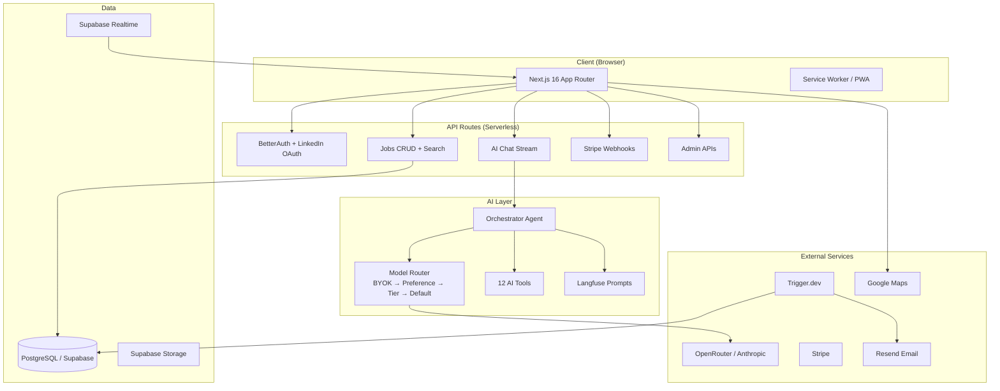

# Hust

AI-powered job search platform. Chat with AI to find, apply, and land your dream job.

## Overview

Hust is an AI-first job search platform where the primary UX is a conversational AI assistant. After LinkedIn login, users interact through a split-screen interface: AI chat on the left and a dynamic data canvas on the right.

**Domain**: everjobs.ai

## Features

| Category                | Feature                       | Details                                                                                         |
| ----------------------- | ----------------------------- | ----------------------------------------------------------------------------------------------- |
| **AI Chat**             | Conversational job search     | Split-screen with persistent sessions, deep-link support                                        |
| **Job Canvas**          | List / Split / Map views      | Realtime updates via Supabase, Google Maps integration                                          |
| **AI Tools**            | 12 orchestrated tools         | Search, apply, cover letters, interview prep, salary insights, company research, resume builder |
| **Favorites & Compare** | Side-by-side comparison       | Compare jobs with "Discuss with AI" integration                                                 |
| **Subscriptions**       | Free / Pro / Enterprise tiers | Stripe checkout, gated features, BYOK API keys                                                  |
| **Alerts**              | Custom job alerts             | Email notifications via Resend (daily/weekly)                                                   |
| **Admin**               | Dashboard + white-label       | User management, analytics, branding, org AI config                                             |
| **Enterprise**          | Teams & API                   | Organization accounts, developer API keys, usage analytics                                      |
| **PWA**                 | Installable + offline         | Service worker, push notifications, offline fallback                                            |
| **i18n**                | Multi-language                | Language switcher in sidebar                                                                    |

## Architecture



## Tech Stack

| Layer               | Technology                                                   |
| ------------------- | ------------------------------------------------------------ |
| **Framework**       | Next.js 16.1 (App Router, Turbopack, Server Components)      |
| **Styling**         | Tailwind CSS 4.1 + ShadCN UI                                 |
| **Build**           | Turborepo monorepo + pnpm                                    |
| **Auth**            | BetterAuth v1 (LinkedIn OAuth)                               |
| **Database**        | PostgreSQL via Supabase (Drizzle ORM)                        |
| **AI**              | Vercel AI SDK v6, OpenRouter, Claude Sonnet 4 default        |
| **Observability**   | Langfuse (prompts + tracing), Sentry, PostHog, OpenTelemetry |
| **Payments**        | Stripe subscriptions + webhooks                              |
| **Email**           | React Email + Resend                                         |
| **Background Jobs** | Trigger.dev v3                                               |
| **State**           | Zustand (client), React Query (server state)                 |
| **Testing**         | Jest (1240 unit tests) + Playwright (E2E)                    |
| **Deployment**      | Vercel                                                       |

## Project Structure

```
ever-hust/
├── apps/web/                # Next.js application
│   ├── app/
│   │   ├── (admin)/         # Admin dashboard (route group)
│   │   ├── (auth)/          # Login / signup (route group)
│   │   ├── (dashboard)/     # Main app: chat, jobs, profile, settings
│   │   ├── (marketing)/     # Landing, pricing, about, contact, docs
│   │   └── api/             # 40+ API routes
│   ├── components/          # React components (canvas, chat, admin, etc.)
│   ├── hooks/               # 18 custom hooks
│   └── lib/                 # Utilities, env, stores, constants
├── packages/
│   ├── ai/                  # Orchestrator, model router, tools, prompts
│   ├── auth/                # BetterAuth config
│   ├── cv-parser/           # CV/resume parsing
│   ├── db/                  # Drizzle ORM schemas + migrations
│   ├── email/               # React Email templates + send helpers
│   ├── jobs-api/            # Ever Jobs external API client
│   ├── stripe/              # Stripe checkout, portal, webhooks
│   ├── supabase/            # Supabase client (Realtime + Storage)
│   ├── triggers/            # Trigger.dev background tasks
│   ├── ui/                  # ShadCN shared components
│   ├── utils/               # Shared utilities
│   └── config/              # Shared configs
├── tests/e2e/               # Playwright E2E tests
└── docs/                    # Documentation
```

## Getting Started

### Prerequisites

- Node.js 22+
- pnpm 10+
- Supabase account
- LinkedIn Developer App
- Stripe account
- AI provider key (OpenRouter or Anthropic)

### Setup

```bash
# Install dependencies
pnpm install --ignore-scripts

# Copy environment variables
cp .env.example .env.local
# Fill in the values in .env.local

# Push database schema
pnpm db:push

# Seed development data
pnpm db:seed

# Start development
pnpm dev
```

### Commands

```bash
pnpm dev           # Start all apps in development mode
pnpm build         # Build all packages and apps
pnpm lint          # Lint all packages
pnpm check-types   # TypeScript type checking
pnpm test          # Run unit tests (38 suites, 1240 tests)
pnpm test:e2e      # Run Playwright E2E tests
pnpm db:push       # Push schema changes to database
pnpm db:migrate    # Run database migrations
pnpm db:seed       # Seed database with test data
pnpm db:studio     # Open Drizzle Studio
pnpm db:generate   # Generate migration files
```

### Environment Variables

See `.env.example` for the complete list. Key groups:

| Group             | Variables                                                    | Required          |
| ----------------- | ------------------------------------------------------------ | ----------------- |
| **Database**      | `DATABASE_URL`                                               | ✅                |
| **Supabase**      | `NEXT_PUBLIC_SUPABASE_URL`, `NEXT_PUBLIC_SUPABASE_ANON_KEY`  | ✅                |
| **Auth**          | `BETTER_AUTH_SECRET`, `BETTER_AUTH_URL`, `LINKEDIN_CLIENT_*` | ✅                |
| **AI**            | `OPENROUTER_API_KEY` or `ANTHROPIC_API_KEY`                  | ✅ (at least one) |
| **Stripe**        | `STRIPE_SECRET_KEY`, `STRIPE_WEBHOOK_SECRET`                 | Production only   |
| **Email**         | `RESEND_API_KEY`                                             | Production only   |
| **Analytics**     | `NEXT_PUBLIC_POSTHOG_KEY`, `NEXT_PUBLIC_SENTRY_DSN`          | Optional          |
| **Observability** | `LANGFUSE_*`                                                 | Optional          |
| **Maps**          | `NEXT_PUBLIC_GOOGLE_MAPS_API_KEY`                            | Optional          |

## Testing

```bash
# Run all unit tests
pnpm test

# Run specific project
pnpm test -- --selectProjects ai
pnpm test -- --selectProjects stripe

# Run with coverage
pnpm test -- --coverage

# Run E2E tests
pnpm test:e2e
```

**Current coverage:** 38 test suites, 1240 tests across 9 projects. See [docs/TESTING.md](docs/TESTING.md) for details.

## Documentation

| Document                                                 | Description                                          |
| -------------------------------------------------------- | ---------------------------------------------------- |
| [PRD](docs/PRD.md)                                       | Full product requirements with implementation status |
| [MVP Summary](docs/MVP-IMPLEMENTATION-SUMMARY.md)        | Detailed changelog of all 12 implementation batches  |
| [Architecture Decisions](docs/ARCHITECTURE-DECISIONS.md) | 15 ADRs covering key design choices                  |
| [Testing Guide](docs/TESTING.md)                         | Test setup, running, and writing guide               |

## License

Proprietary. All rights reserved. See [LICENSE](LICENSE) for details.

Copyright (c) 2026 Ever Co. LTD.
