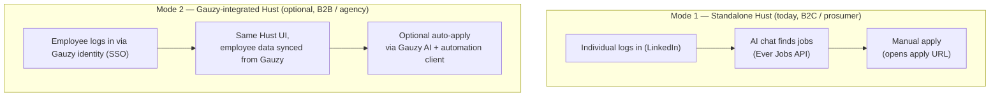
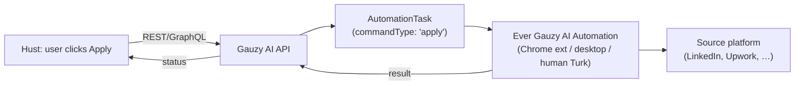
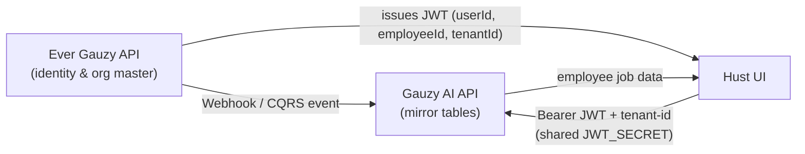

# Hust ↔ Gauzy / Gauzy AI — Optional Integration

How Hust relates to the wider **Ever Gauzy** platform, what it can be used for on its own
versus alongside Gauzy, and how the (optional, future) integrations are designed to work.

> [!IMPORTANT]
> **Hust is a standalone product.** It runs fully without any Gauzy product. Its only hard
> external dependency is the **Ever Jobs API** (for job listings). Everything described below
> under "Gauzy AI integration" is **optional and additive** — it unlocks the agency/company
> scenario without changing the self-serve experience.

---

## TL;DR

| | |
| --- | --- |
| **What Hust is by itself** | An AI-first, single-user job-search assistant (chat + jobs canvas). Self-serve consumers and individual job seekers. |
| **Hard dependencies** | **Ever Jobs API** only (job data). Plus the usual self-owned infra: Supabase/Postgres, an AI provider key, Stripe, Resend. |
| **Optional, future integrations** | Two seams into the Gauzy stack, both via the **Gauzy AI API**: **(A) auto-apply** and **(B) identity / employee / org / tenant sync (SSO)**. |
| **Why integrate** | So one Hust codebase serves **both** self-serve consumers **and** agencies/companies that run the full Ever Gauzy platform (managers sourcing & applying for whole teams, at scale). |
| **Status today** | Integrations are **designed, not wired**. The Gauzy AI side already exposes the contracts; Hust ships fully standalone. |

---

## 1. Standalone-first principle (non-negotiable)

Hust must always build, run, and ship **without** Gauzy or Gauzy AI present. This is a hard
product constraint, not a preference. Concretely, in the current (shipped) product Hust owns
its entire stack:

| Concern | Standalone Hust owns it via | Notes |
| --- | --- | --- |
| **Auth / login** | BetterAuth + LinkedIn OAuth | Own session cookies, own user records |
| **Users / orgs / members** | Own Postgres tables (`users`, `organizations`, `organizationMembers`, …) | Orgs here are for seat-billing / shared AI config / white-label — see [README](../README.md) |
| **Job data** | **Ever Jobs API** (`packages/jobs-api`) | The one hard external dependency |
| **AI** | Vercel AI SDK + Claude (Anthropic or OpenRouter), optional BYOK | Org-level AI config supported |
| **Apply** | Opens the job's apply URL (manual) | Auto-apply is the optional Seam A below |
| **Payments / email / jobs** | Stripe, Resend, Trigger.dev | All self-owned |

> Rule for contributors: **never introduce a hard dependency on a Gauzy product.** Any Gauzy /
> Gauzy AI capability must sit behind a feature flag + adapter and degrade gracefully to the
> standalone behavior when not configured. See [§8](#8-design-rules-for-contributors).

---

## 2. The product spectrum — two modes from one codebase

- **Mode 1 (Standalone):** the shipped product. A consumer or solo job seeker uses Hust on its
  own. Applies manually. No Gauzy anything.
- **Mode 2 (Gauzy-integrated):** an agency or company already running **Ever Gauzy** (HR / org /
  employee management) and **Ever Gauzy AI** (job matching, scoring, automation) plugs Hust in as
  the **employee-facing job-search & apply UI**. Adds SSO, employee sync, and optional auto-apply.

Both modes are the **same Hust app** — Mode 2 is Mode 1 with two optional seams switched on.

---

## 3. Where Hust fits — the five-system map

In the full Ever Gauzy platform, Hust is the **client/frontend layer** for job search & apply:

| System | Role relative to Hust | Repo |
| --- | --- | --- |
| **Ever Hust** (this repo) | Employee-facing SaaS UI: chat, browse, apply, track | `ever-hust/ever-hust` |
| **Ever Jobs API** | Job listings (read-only scraping of 60+ boards). **Hust's only hard dependency.** | `ever-jobs/ever-jobs` |
| **Ever Gauzy API** | *(optional)* Identity master: tenants, orgs, users, employees, roles, campaigns, pipelines | `ever-co/ever-gauzy` |
| **Ever Gauzy AI API** | *(optional)* AI/crawler backend: matching, scoring, proposals, **apply task queue**, Novu alerts | `ever-co/ever-gauzy-ai` |
| **Ever Gauzy AI Automation** | *(optional)* Client-side executor that performs the actual job application on the employee's PC | `ever-co/ever-gauzy-ai-automation` |

Hust talks to **Ever Jobs API** today. The optional seams add calls to **Ever Gauzy AI API**
(which in turn coordinates with Ever Gauzy API and the automation client).

---

## 4. Seam A — Optional auto-apply

**Default behavior (standalone):** the user reviews the AI-drafted cover letter and applies
**manually** — Hust opens the source's apply URL. Most users stay here.

**Integrated behavior (optional):** the application is **executed for the user** by the Gauzy
stack, so the employee never leaves Hust.

How it's designed to work:

- Hust POSTs an application (proposal + Q&A + terms) to Gauzy AI, which creates an
  `AutomationTask` with `commandType: 'apply'`.
- The **Ever Gauzy AI Automation** client (running on the employee's machine, or a human
  Mechanical-Turk operator) picks up the task and submits the application on the source site.
- Status flows back to Hust and is stored on the application record.

**Effort to add:** the *code* seam in Hust is small — swap "open apply URL" for "POST an apply
task to Gauzy AI." The Gauzy AI apply pipeline and the automation client **already exist** by
design. The *operational* weight is real: it requires the Gauzy AI backend deployed **and** the
automation client installed per user (or human operators). That's why it's an opt-in for the
agency scenario, not the consumer default.

**Reference:** Gauzy AI [`ai-and-automation.md`](../../gauzy-ai/docs/ai-and-automation.md)
(Automation Task System, Job Application Pipeline) and
[`data-model.md`](../../gauzy-ai/docs/data-model.md) (`AutomationTask`).

---

## 5. Seam B — Optional identity & employee/org/tenant sync (SSO)

**Default behavior (standalone):** Hust authenticates users itself (BetterAuth + LinkedIn) and
stores them in its own database.

**Integrated behavior (optional):** **Ever Gauzy API becomes the identity & org master.** A
company's employees, teams, orgs, and tenants live in Gauzy; Hust authenticates those same
identities (SSO) and works the employee's job data without re-registering anyone.

How it's designed to work:

1. **Sync:** Gauzy API is the source of truth for Tenant / Organization / User / Employee. When
   those change, a **Webhook or CQRS event** updates Gauzy AI's **mirror records**, cross-linked
   by `externalTenantId` / `externalOrgId` / `externalUserId` / `externalEmployeeId`.
2. **SSO:** Login is a **shared Bearer JWT** issued by Gauzy API (carrying `userId`,
   `employeeId`, `tenantId`), verified by Gauzy AI via a shared `JWT_SECRET`. The same token logs
   the employee into Gauzy, Gauzy AI, and Hust — so an employee onboarded in Gauzy can land in
   Hust and immediately continue searching & applying.

> Note: enterprise **SAML/Okta SSO** is a separate, later enterprise feature. The cross-system
> login described here is the **shared-JWT** mechanism that Gauzy AI already supports.

**Effort to add:** this is the heavier of the two seams. The Gauzy AI side is **fully
contract-specified** (mirror tables, external IDs, Bearer-JWT auth, webhook sync). But the
**shipped Hust is auth-decoupled** (own BetterAuth + LinkedIn + Supabase), so lighting up Seam B
is an **auth-bridge + sync-consumer build-out** in Hust — real integration work, but not a
redesign, because the interfaces already exist.

**Reference:** Gauzy AI [`authentication.md`](../../gauzy-ai/docs/authentication.md) (Bearer
Token / JWT, "Ever Hust → Gauzy AI" example) and the **Data Synchronization Strategy** in the
Gauzy AI [`prd.md`](../../gauzy-ai/docs/prd.md).

---

## 6. The agency / company use case (why this matters)

Standalone Hust serves **one person finding their own job**. The Gauzy integration unlocks the
**agency / company** scenario, where a business finds & applies to jobs **on behalf of its
employees at scale**:

- A staffing agency or dev shop runs **Ever Gauzy** for its orgs, teams, employees, roles, and
  CRM-style pipelines.
- **Ever Gauzy AI** continuously crawls sources, **scores** each job against each employee's
  profile, and (optionally) **auto-applies** with AI-generated proposals.
- **Hust** is the **polished employee/manager-facing UI** for that flow: an employee logs in via
  SSO, sees the jobs matched to them, reviews proposals, and applies — manually or via auto-apply.
- **Ever Gauzy AI Automation** executes the applications that can't be submitted via an API.

In short: **Gauzy = the back office (who the employees are, the pipeline), Gauzy AI = the engine
(match, score, apply), Hust = the front door (where employees actually work the jobs).** A
consumer using Hust standalone simply never sees any of that machinery.

---

## 7. Current status vs. designed

| Capability | Standalone Hust (shipped) | Gauzy-integrated (designed, optional) |
| --- | --- | --- |
| **Login** | Own BetterAuth + LinkedIn | Shared Gauzy JWT (SSO) — *build-out needed in Hust* |
| **Users / employees** | Own Supabase tables | Mirrored from Gauzy via webhook/CQRS — *build-out needed* |
| **Job data** | Ever Jobs API ✅ | Ever Jobs API (unchanged) ✅ |
| **Apply** | Manual (open URL) ✅ | Optional auto-apply via Gauzy AI — *small Hust seam; Gauzy AI pipeline ready* |
| **Agency / team sourcing** | Not applicable | Provided by Gauzy + Gauzy AI |

**Bottom line:** the Gauzy AI side already defines and exposes both seams. Hust intentionally
shipped standalone-first; turning on integration is **additive future work**, gated behind
configuration, and never required for Hust to function.

---

## 8. Design rules for contributors

1. **Standalone must always work.** Hust builds, runs, and passes tests with **zero** Gauzy
   config. Only `packages/jobs-api` (Ever Jobs API) is a hard dependency.
2. **Gauzy behind a flag + adapter.** Any Gauzy / Gauzy AI capability lives behind a feature flag
   and an adapter interface, with the standalone path as the default fallback.
3. **No Gauzy types leaking into core.** Keep Gauzy-specific clients in their own package(s);
   don't couple core auth/jobs/apply code to Gauzy entities.
4. **Don't rename Ever Jobs API references to "Hust."** `packages/jobs-api` targets an external
   service (see [`AGENTS.md`](../AGENTS.md)).

---

## 9. Reference — Gauzy AI docs

| Topic | Doc |
| --- | --- |
| Auth model & shared-JWT SSO | [`authentication.md`](../../gauzy-ai/docs/authentication.md) |
| Auto-apply (AutomationTask, apply pipeline) | [`ai-and-automation.md`](../../gauzy-ai/docs/ai-and-automation.md) |
| Mirror entities & external IDs | [`data-model.md`](../../gauzy-ai/docs/data-model.md) |
| Five-system landscape & cross-system refs | [`architecture.md`](../../gauzy-ai/docs/architecture.md) |
| Full agency vision (personas, roadmap) | [`prd.md`](../../gauzy-ai/docs/prd.md) |
| Hust integration, from Gauzy AI's side | [`hust-integration.md`](../../gauzy-ai/docs/hust-integration.md) |
